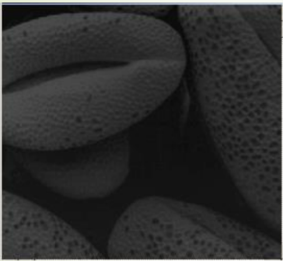
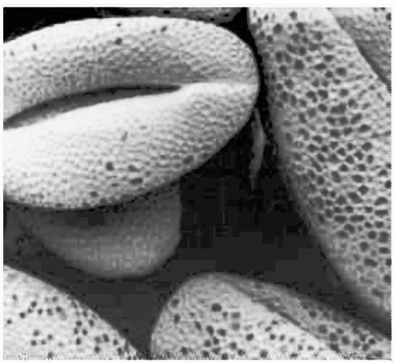

# Image-Processing App

## 🔗 Introduction

**Image-Processing App** is a comprehensive tool designed to streamline the process of Digital Image Processing (DIP). This project provides essential features for:

- Image Enhancement
- Image Restoration
- Morphological Processing
- Image Segmentation
- Object Recognition
- Color Processing
- Image Compression

Whether you're a researcher, developer, or enthusiast, this application aims to simplify your image processing tasks by integrating various tools in one platform.

This project offers two options for utilizing image processing tools:
1. **Custom Algorithms**: Use image processing algorithms written by the project creator to have more control and customization.
2. **Pre-built OpenCV Functions**: Leverage the powerful, well-optimized functions available in the OpenCV library for faster and more efficient processing.

---

## 🎥 Demo

A simple demo video showcasing the core features of the Image-Processing App is available below:

<div align="center">
  
</div>

---

## 🖼️ Example Results

Below are an example results of image processing using the app:
- Histogram Equalization

| Before | After |
|--------|-------|
|  |  |


---

## 🐳 Technologies Used

This project is built using **Python**, leveraging key libraries such as:

- **FastAPI** for building the backend API
- **Uvicorn** for running the asynchronous server
- **Streamlit** for creating an interactive frontend interface

Additional libraries for image processing and machine learning include:

- OpenCV
- NumPy
- Scikit-image
- Pillow

---

## 📝 Installation Guide

Follow these steps to set up the project on your local machine:

### 1. Clone the Repository

```bash
git clone https://github.com/Andree-02/Image-Processing.git
cd <repository path>
```

### 2. Install Dependencies

Ensure you have Python installed. Then, run the following command to install the required packages:

```bash
pip install -r requirements.txt
```

---

## 🚀 How to Use

### 1. Start the Backend Server

Navigate to the project root directory and run the FastAPI backend server using Uvicorn:

```bash
uvicorn server:app --port 8000 --reload
```

This will start the API server at **[http://localhost:8000](http://localhost:8000)**.

### 2. Launch the Frontend Interface

Navigate to the `FE` directory and run the Streamlit app:

```bash
cd FE
streamlit run Home.py
```

This will open a web-based user interface for interacting with the image processing tools.

---

## 📲 Example Usage

Once both the backend and frontend are running:

1. Open your web browser and go to **[http://localhost:8501](http://localhost:8501)**.
2. Upload an image through the interface.
3. Apply various processing techniques, such as enhancement, segmentation, or object recognition.

---

## 🔧 Contributing

We welcome contributions to improve this project! Please follow the guidelines:

1. Fork the repository.
2. Create a new branch.
3. Commit your changes.
4. Open a pull request.

---

## 📢 Contact

For any inquiries, feel free to reach out:

- **Project Maintainer:** [Andree-02](https://github.com/Andree-02)
- **Email:** [trantientoan.wk@gmail.com](mailto:trantientoan.wk@gmail.com)
- **GitHub:** [https://github.com/Andree-02](https://github.com/Andree-02)

---

## 🌟 Acknowledgments

Special thanks to the open-source community for providing invaluable tools and resources.

